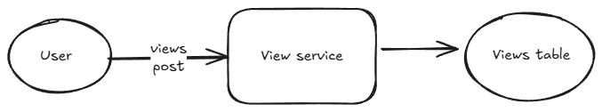
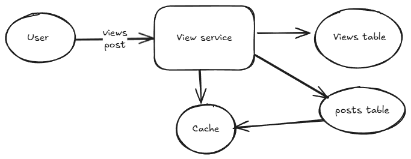
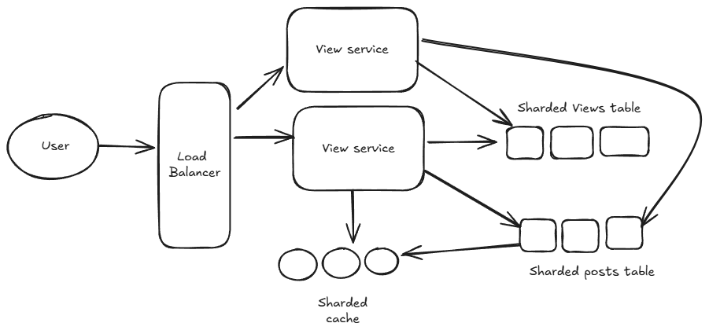
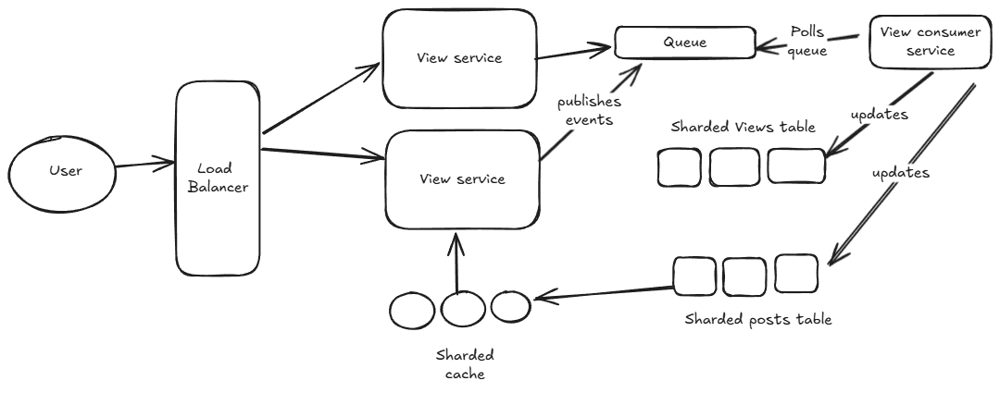

# Real-Time Post Views Counter

## ✅ Problem Statement

Design a distributed and scalable system to track the number of views for each post on a large-scale platform (like Medium, YouTube, or Instagram).

Unlike likes, views can happen at a much higher rate (e.g., autoplay, scrolls) and are idempotent in some cases (e.g., same user viewing multiple times in a session might not count again). However, this behavior is configurable per use case.

## Answer

We will be solving this design problem in steps. All the steps and description are specified below

1. **Functional requirements (Core requirements)**

    - Users should be able to view a post
    - Both Author and other users should be able to see the no of views on a post
    - Both Author and other users should be able to see the people who viewed a post
    - Once a user views a post, he should instantly see the view count increasing.

2. **Non Functional requirements**

    - System should be highly available, failure in one component should not bring the whole system down.
    - System should be scalable and support millions of views at higher rate.
    - System should support low latency, Once a user views a post, he should instantly see the view count increasing.
    - System can be eventually consistent.
    - System should be idempotent, a user view for a post should count as 1.
    - The system should support analytics use cases like identifying trending posts (e.g., most-viewed posts in the last hour).

3. **Core entities**

    Here are the core entities of the system

    - Post: This entity represents the post. It can have below attributes.

    ```json
        id: Id of the post
        title: Title of the post
        content: Content of the post
        imageURLs: List of Image URLs of the post stored in object storage like S3.
        authorId: User id of the author
        createdAt: Timestamp when the post was created
        viewsCount: Count of likes
    ```

    - User: User of the system

        ```json
            id: Id of the user
            name: Name of the user
            email: Email of the user
            bio: Bio of user
            ... other fields
        ```

    - View: Views entity

        ```json
        postId: Id of the post
        userId: Id of the user who viewed the post
        timestamp: Time at which the post was viewed
        ```

4. **APIs**

    Below are the core APIs that our system will support

    - Post endpoint to view a post
  
        ```json
        POST /posts/{id}/views
        Response 200 OK
        ```

    - Get endpoint to see views for a post

        ```json
        GET /posts/{id}/views
        Response 200 OK
        [
            {
                "postId": <Id of posts>,
                "viewCount": <Count of views>
            }
        ]
        ```

5. **High level design**

    We will begin with a simple singe node design and gradually improve it and make it distributed.

    **Single database design**

    We can store the posts in a post table and views in another table called views. In that case if a user views a post, we run the below query to insert a row in the `views` table.

    ```SQL
    INSERT INTO views(postId, userId)
    ```

    When we want to see no of views for a post, we run below simple query

    ```SQL
    SELECT COUNT(1) FROM views where postId = <Id of the post>
    ```

    When we want to see the users who viewed the post, we can run below query

    ```SQL
    SELECT userId from views where postId = <Id of post>
    ```

    To support fast queries, we can index the postId column.

    In this way, our design will look something like in below figure.


    

    **Benefits**

    - Simple: The design is simple and easier to implement.
    - Consistent: The design support strong consistency, once a view in recorded in the database, all the users will be seeing same view count.

    **Drawbacks**
    - Not scalable: The design is not scalable. It just has a single database and that cannot support millions of views at any point of time.
    - Does not support low latency: The count query can become an overhead when there are millions of records in the database, even with indexing it will not be performant.
    - Not highly available: With more traffic, both the view service and DB tables will become single point of failure.

    **Improved read performance**

    In order to improve our earlier design and support low latency reads, we can go ahead and follow below two steps

    - Precompute no of views
    - Add a cache layer

    **Precompute no of views**
    In order to precompute no of views, we can add another column to the posts table called view_count which will hold the no of views for the posts.

    How will it work ?
    - On a view, we will insert an row in views table and update view count for the post in post table.
    - Since both tables are in same database, we can use transactions to prevent system in bad state

    ```SQL
    BEGIN TRANSACTION
    INSERT INTO views(postId, userId)
    UPDATE posts
    SET viewCount = viewCount + 1
    WHERE postId = <Id of post>
    COMMIT
    ```

    Now, when we want to read no of views for a post, the post row will have it pre computed and we do not have to run the expensive count query every time.

    **Cache layer**
    We will also add a cache layer like redis which will store key value pairs - <postId, viewCount>
    When we want to fetch the no of views, we will first query the cache, if it has we will return from cache. In case of cache miss, we will query our DB and update the cache and return the response.

    In case of a post view event, we will invalidate the cache entry for the post.

    Now our design will look something like this

    

    **Benefits**
    - Improved read latency: Adding cache, and pre computing the view counts improves the read latency.
    - Improved scalability for reads: With cache and pre computing the views counts results in improved scalability.

    **Drawbacks**
    - Write contention: In case of a view, we need to make two writes to the DB. In case of huge traffic and for celebrity posts, the view counts will increase significantly leading to write contention
    - Single point of failures: With more traffic, both the view service and DB tables will become single point of failure.

    **Improved writes**

    In order to improve the performance of the system to support million of writes simultaneously, we need to partition the database using a technique called `sharding`

    There are two common techniques to achieve sharding

    - Range based sharding: In this case, we partition the data into ranges, e.g. post with id 0 to 100 go to one shard, post with id 101 to 200 go to another etc,
    - Hash based sharding: In this case we take the hash of the post id and put it in the shard pointed to by the hash result.

    We will take `postId` as the key on which we will shard. In this way views for each post will go to the same shard. We will shard both views and posts table in same way using hash based sharding.

    How will this work ?

    - On a view: We will compute the hash of the postId to determine the shard, and forward the request to that shard.
    - In case of a request to fetch the view count, we again will compute the hash of the postId to determine the shard, and forward the request to that shard.
    - We will also shard the cache using similar techniques to support faster writes and reads.

    In order to prevent the view service to be a single point of failure, we will replicate the view service and use a load balancer to distribute the requests between the replicated services.

    Now our design will look something like this

    

    **Benefits**
    - Better handling of write contention
    - Better availability
    - No single points of failures

    **Drawbacks**
    - This will introduce a problem when one of the shard will become a hot spot, because of a celebrity post residing on it and majority of view requests going there.
    - Increased complexity with sharding and replication
    - No async processing, all the writes are synchronous and might lead to slower user experience.

    **Solving hotspot issue**

    In order to solve one of the shard becoming a hot shard, we can use a sharded counter approach. 
    To handle this, we can shard within a single post. Instead of maintaining one view count per post, we split it into multiple sub-counters.

    Example:
    - For post_id 123, create 10 sub-counters (buckets): counter_0, counter_1, ..., counter_9
    - Each user is assigned to a bucket based on hash(user_id) % 10 and each bucket is stored on a different shard.
    - When user U views post 123, update the sub-counter:
    bucket = hash(user_id) % 10 → counter_3
    - Total views = sum of all 10 bucket counts.

    **Asynchronous processing**
    Now as we have solved the write contention issue, we are still not supporting any form of asynchronous processing which might lead to slower user experience.

    To solve this we can introduce a message queue like Kafka or RabbitMQ to our design.
    How will this work ?

    In case of a view event, we will not directly update the database shard. Instead we will do below steps

    - On receiving a view request, we will publish an event like below to the queue and return immediately back to the user.
  
        ```json
        {"event": "view_post", "postId": "Abc123", "userId": "user123", "timestamp": "Mon 12 July 2025, 4:10"}
        ```

    - We will have worker processes called view consumer service, which will poll such events from the queue and update the views and post tables. After they finish processing, they will mark the event to be done.
    - The UI will immediately reflect the change and not wait on the background process to complete, leading to better and faster user experience.
    - The view consumer service can also process events in batches for faster writes.
    - Reads will continue to be served from cache and DB.

    So now with message queue in place our design will look like below

    

    **Benefits**
    - Faster User experience
    - Better processing of requests with background queues and workers
    - No view request is lost as message queue guarantee at-least-once delivery.

    **Drawbacks**
    - Can lead to a request being processed more than once as message queue guarantee at-least-once delivery.
    - Complicated design and we now need to manage and maintain a consumer service and queue.
    - UI Feedback Loop: Since counts are updated asynchronously, the like count shown may not match the backend immediately. This is usually handled by optimistic UI updates, and users rarely notice.

    **Idempotency**
    With the introduction of message queue, we will hit into an issue where  request being processed more than once as message queue guarantee at-least-once delivery.

    Lets suppose a scenario, a worker was processing an event from the queue and the worker updated the tables and crashed before marking an event completed. The queue will retry the event and it will lead to duplicate requests being served.

    In order to solve this issue, we can introduce another table like `UserLastAction`, which will have columns like postId, userId, lastAction. The last action will be set to true if the user has already viewed the post.

    So the flow will now work like this
    - In case of a view request, we first check the `UserLastAction` table. If the last action is set to true, we ignore the request, else we process it.

6. **Analytics**

    Since we are already having events getting published to a message queue, we can use streaming frameworks like apache spark which can listen on the message queue for events and use windowing logic on the stream of data to produce most viewed post for a window.

    To support use cases like top N posts for a time duration.

    - We can use materialized views having top n posts having huge volume of views for a given time
    - These views can be refreshed periodically by a background process.
